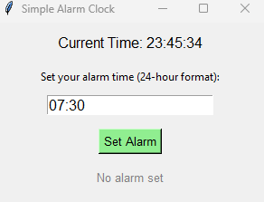

# Alarm Clock APP


## Screenshot



## Description
Simple Alarm Clock is a Python application with a graphical user interface (GUI) built using Tkinter. It allows users to set an alarm for a specific time in 24-hour format, displays the current time, and triggers a notification with a beep sound when the alarm time is reached.

## Features
- Real-time clock display updated every second.
- Set an alarm by entering a time in HH:MM format (24-hour).
- Option to cancel an alarm before it triggers.
- Visual feedback with status updates and color-coded buttons.
- Alarm notification with a pop-up message and beep sound (Windows only).

## Quick Start

### Installation
1. Clone the repository:
   ```bash
   git clone https://github.com/fahadelahikhan/Alarm-Clock-App.git
   cd Alarm-Clock-App
   ```
2. Ensure Python 3.8 or higher is installed.
3. No additional dependencies are required, as the project uses Python's standard library (`tkinter`, `time`, `threading`, and `winsound`).

### Basic Usage
1. Run the application:
   ```bash
   python Alarm Clock App.py
   ```
2. Enter a time in HH:MM format (e.g., `07:30`) in the input field.
3. Click "Set Alarm" to activate the alarm or "Cancel Alarm" to deactivate it.
4. When the alarm triggers, a pop-up message appears, and a beep sound plays (on Windows).

## License
Distributed under the CC BY-NC-ND 4.0 License. See `LICENSE.txt` for details.